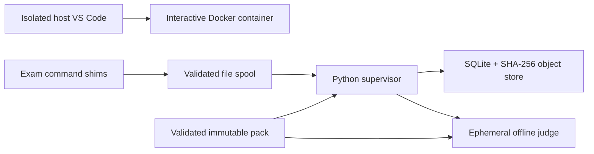

# CSEExamTTY implementation and public-alpha record

Baseline date: 2026-08-06

Status: stages 1–5 are implemented on the Apple Silicon local alpha. Both
current course images passed fresh Stage 4 prepare/offline-attach checks on
2026-08-06. COMP1511 passed its full end-to-end workflow; COMP1521 passed a live
MIPS/autotest/submission/finish/report workflow using the repository's
independent `csetty-mips` runtime. Stage 6 source-only `0.1.0a1` was published;
the source tree now prepares the fail-closed `0.1.0a3` release candidate, and
subsequent releases use the protected GitHub Actions/PyPI OIDC path. Stable
`0.1.0` desktop acceptance remains open.

## 1. Product boundary

CSEExamTTY provides behavioural compatibility with a local COMP1511/COMP1521
practical-exam workflow. It does not authenticate against, connect to, submit
to, or claim endorsement by UNSW. All questions and simulator wording are
original; public course pages are structural references only.

The host owns authoritative time, state, submissions, and grading. An
interactive Docker container owns editing/manual execution. A fresh ephemeral
judge receives a read-only accepted snapshot and sanitized test assets.



## 2. Implemented external contract

The v0.1 CLI implements:

```text
csetty doctor [--offline-ready PROFILE]
csetty prepare --profile comp1511|comp1521|all [--mipsy-source PATH]
csetty packs list
csetty pack validate PATH
csetty pack verify PATH --reference PATH
csetty start PACK [--mode practice|exam] [--editor code|terminal]
                  [--workspace PATH] [--network none|on]
                  [--timed] [--skip-reading]
csetty resume [ATTEMPT_ID]
csetty code [ATTEMPT_ID]
csetty export ATTEMPT_ID DESTINATION
csetty attempts list
csetty report [ATTEMPT_ID] [--json]
```

The complete container command contract is maintained in `COMMAND_SPEC.md`.

## 3. Stage status

### Stage 1 — Foundation and technical spikes: complete on current Mac

- Typed `src/csetty` Python 3.11+ package with argparse, TOML, SQLite, and only
  `platformdirs` as a required runtime dependency.
- pytest, Ruff, and strict mypy development checks.
- Migration registry, UTC clock serialization, injectable frozen clock, and
  explicit toolchain lock.
- Local Docker images built from Debian 12 for the host architecture. COMP1521
  stages the pinned external MPL-2.0 `csetty-mips` dependency and no upstream
  mipsy source or binary.
- DCC compile/runtime diagnostics, file IPC, isolated VS Code attach, and
  offline reopen exercised against the current COMP1511 image. The current
  COMP1521 image passed 92 original MIPS cases, the fixed-pack judge, Docker
  containment, and isolated VS Code attachment.

### Stage 2 — Core domain: complete

- Schema-v1 pack parser with path, command, resource, score, timeout, and hurdle
  validation.
- Attempt state machine: `CREATED -> READING -> WORKING -> FINISHED/EXPIRED`,
  plus `ABORTED` for controlled test cleanup.
- Persisted UTC deadlines and monotonic live reading countdown.
- Content-addressed objects, atomic writes, submission sequence history, test
  runs, grades, report-finalization markers, events, leases, and deadline-warning
  records.
- Weighted all-or-nothing groups, question pass points, cross-question hurdles,
  and explicit not-automatically-assessed remainder.

### Stage 3 — Container runtime: complete for local alpha

- Persistent Docker volume and opt-in empty bind-directory backends.
- Host-only read-only reading view; no editable container exists during reading.
- Background supervisor recovery without deadline recalculation.
- Validated JSON request spool with protocol/attempt/token/UUID/operation checks,
  64 KiB limit, staleness checks, rate limit, and idempotent replay.
- Symlink- and traversal-resistant workspace read/write/snapshot paths.
- Interactive and judge isolation: non-root, read-only rootfs, tmpfs, resource
  limits, capabilities dropped, no-new-privileges, no Docker socket.
- Judge always offline; each test gets a clean directory and bounded
  time/output. Author `solutions/` never enters the sanitized judge mount.
- Result classes cover pass, compilation, output, exit, runtime, timeout,
  output-limit, and infrastructure failures.
- Terminal broadcasts at 60, 30, 15, and 5 minutes remaining.

### Stage 4 — VS Code and course profiles: complete on current Mac

- Host Desktop plus container Server architecture.
- Per-course isolated host user-data/extension directories and visible red
  CSEExamTTY title/status bar.
- Dev Containers host extension; C/C++ remote extension for both courses; Mipsy
  Editor Features remote extension for COMP1521.
- AI features, Settings Sync, telemetry, updates, Git, port forwarding,
  credential helpers, dotfiles, and SSH-agent forwarding disabled.
- Preparation caches the exact host VS Code Server/remote extensions and writes
  a readiness manifest; attempt attach fails closed when VS Code commit, image
  ID, or caches change.
- Preparation window is detached to a local completion page before the
  disposable network is removed and its container stopped.

### Stage 5 — Original complete packs: complete

- `comp1511-original-a`: 10-minute reading, 180-minute work, 11 questions, 100
  points; linked lists, arrays, debugging, functions, and whole programs.
- `comp1521-original-a`: 10-minute reading, 180-minute work, 10 questions, 100
  points; bits, C/MIPS translation/execution, POSIX I/O, processes, and threads.
- Every question has starter content, public and after-finish groups, weights,
  pass thresholds, and an author reference solution.
- Reference solutions are excluded from pack identity and student/judge access.
- Both packs passed reference verification in the real judge against their
  current images on 2026-08-06. The COMP1521 report records
  `csetty-mips 0.1.1` plus the local engine/version/license image labels.
- `csetty bank verify` builds an author-only all-question pack and runs the same
  real judge across every source-bank question. Both banks passed 75/75 on
  2026-08-06; this check is part of both Docker CI jobs.

### Stage 6 — Source-only public alpha: published

The `0.1.0a1` alpha publishes source and Python distributions only. The
following release engineering work is complete:

- the wheel installs from outside a checkout with both pip and an isolated
  `uv tool install`; original author materials remain host-only for post-exam
  reports, while student snapshots/build contexts exclude them and the wheel
  excludes any upstream mipsy binary;
- checked-in workflows source-build separate interactive/judge targets for both
  courses as runner-local `linux/amd64` + `linux/arm64` OCI layouts with SPDX
  SBOM and SLSA provenance attestations, without uploading them;
- the Debian multi-architecture index and DCC source archive are integrity
  pinned; DCC is compiled locally and each image contains the GPLv3 text and
  source provenance;
- the local release verification set includes a hash-verified DCC 2.37 source
  archive, Python CycloneDX SBOM, and checksums; the DCC archive is not itself a
  published project artifact; and
- a fail-closed public gate refuses tagging/PyPI upload while owner or public-CI
  evidence is absent; and
- a dedicated GitHub Actions workflow can publish only pre-staged,
  checksum-verified release wheel/sdist assets through PyPI Trusted Publishing.
  It has no checkout/build step, uses a protected `pypi` environment, pins the
  PyPA action by full commit SHA, and retains the ban on workflow artifact and
  image uploads.

Stable-release acceptance still to complete:

1. broader native Windows 11, macOS Intel/Apple Silicon, and Ubuntu desktop
   Docker/VS Code acceptance;
2. repeatable release-candidate live linux/amd64 and linux/arm64 acceptance;
3. owner review of each final clean-commit wheel/sdist/SBOM/checksum set; and
4. a live protected-environment OIDC publication exercise for the next version.

File-level licensing, DCC source-build notices, independent `csetty-mips`
provenance/MPL notices, the no-redistribution VS Code/extension boundary, and
name/non-affiliation wording are recorded in
`docs/RELEASE_EVIDENCE_0.1.0a1.md`.

The alpha does not claim native Docker Desktop/WSL2 or offline VS Code
acceptance on every host. Those remain stable `0.1.0` gates alongside broader
Windows 11, macOS Intel/Apple Silicon, and Ubuntu desktop testing.

No upstream mipsy checkout or executable is a release artifact. The canonical
COMP1521 local build uses only `csetty-mips`; no prebuilt course image is a
project release artifact.

## 4. Exam-mode entry and timing

Exam mode first presents a host-terminal welcome, simulated zID/password, the
explicit non-UNSW disclaimer, and an original academic-integrity/exam-condition
warning. Only `yes` proceeds. The simulation password is never retained.

After acceptance, the companion opens every complete prompt as a read-only
long-form paper. The workspace, interactive container, and VS Code are created
only after reading ends; the existing page then refreshes to working state.
Before the reading anchor is recorded, `CREATED` exposes only a waiting page and
the persisted practice skip-reading flag governs recovery.
Live paper and final report share the same packaged CSE course-exam theme, with
the COMP1511 green or COMP1521 teal profile variant selected from attempt
metadata. Exam mode is always timed and offline. Practice is untimed by default
and has no pause function when explicitly timed.

While working, the supervisor broadcasts fixed terminal warnings at 60, 30, 15,
and 5 minutes. Threshold delivery is persisted so restart does not duplicate or
backfill multiple stale warnings.

## 5. Persistence and grading invariants

- SQLite uses foreign keys, WAL, `synchronous=FULL`, immediate transactions for
  authoritative writes, and versioned migrations.
- Submission files and manifests are addressed by SHA-256; existing objects are
  verified before reuse.
- A submission succeeds only after its durable DB record commits before the
  deadline.
- Repeated submissions are immutable historical sequences.
- Final grading selects each question's latest accepted pre-deadline sequence,
  materializes it from the object store, and never reads the live workspace.
- Reports include attempt/candidate metadata, hashes, pack digest, image ID,
  tool versions, automatic score, paper total, group/test outcomes, hurdles,
  and a prominent local-estimate notice.
- Explicit finish and timed expiry both generate JSON/HTML reports and request
  that the host default browser open the HTML result; browser failure leaves the
  durable files and attempt state intact.

## 6. Security model

Addressed in the local alpha:

- common buggy/malicious student process containment;
- network denial inside exam/judge containers;
- Docker-socket, capabilities, rootfs, host-path, and credential exposure;
- path traversal and symlink escape in fetch/snapshot/export operations;
- output floods, infinite loops, and process-count exhaustion;
- command-bridge spoofing, stale/replayed requests, and arbitrary operations;
- tests mutating the live workspace; and
- author reference solutions appearing in judge/student mounts.

Explicitly outside the threat model:

- the host owner/administrator modifying Docker, the database, object store, or
  system clock;
- host VS Code or another host application using the network;
- truly secret hidden tests on a student-owned local machine; and
- invigilation, kiosk enforcement, webcam/process monitoring, or real identity
  authentication.

## 7. Verification layers

### Automated local checks

```text
ruff check src tests scripts
mypy src/csetty
pytest -q
csetty pack validate packs/comp1511-original-a
csetty pack validate packs/comp1521-original-a
csetty bank verify comp1511
csetty bank verify comp1521
```

Unit tests cover pack/resource boundaries, deadline transitions, object and
submission persistence, bridge idempotency/staleness/token rejection, symlink
containment, judge timeout/output limits, grading/hurdles, exam entry, VS Code
settings/credential environment, autotest detail/colour, and deadline warning
selection.

### Real Docker checks completed on current Mac

- the current COMP1511 image builds and exposes its expected toolchain;
- all 11 COMP1511 author references pass public and after-finish tests on the
  current image;
- default-offline interactive and judge containers cannot egress;
- runtime inspect confirms non-root, read-only rootfs, capability drop,
  no-new-privileges, resource bounds, and no Docker socket;
- volume and bind attempts persist correctly;
- repeated submit/autotest/finish/report works end to end;
- a modified live file after submission does not affect final grade;
- supervisor restart does not extend the deadline; and
- the companion **Open VSC** action reattaches the isolated VS Code profile and
  waits for the exact matching Server process; and
- isolated COMP1511 VS Code attaches offline without forwarding host
  credentials.

The current `csetty/comp1521:dev` image is built from the project definition and
the pinned `csetty-mips 0.1.1` dependency behind `/usr/local/bin/mipsy`. On 2026-08-06 it
passed all 92 original MIPS reference cases, all ten fixed-pack questions in the
real judge, the live Docker security/toolchain suite, offline VS Code attach,
failed/passed autotest behavior, immutable submission, after-finish grading, and
report provenance checks. No `--mipsy-source` checkout was used for the image.

Cross-platform release claims must not be made until stage 6 is completed.

## 8. Release risks

| Risk | Current mitigation |
|---|---|
| Docker Desktop is a large prerequisite | Explicit `doctor`; no hidden native fallback |
| VS Code updates invalidate offline Server cache | Commit/image readiness checks and actionable re-prepare error |
| Upstream mipsy has no reviewed redistribution license | Excluded from wheel/images; optional pinned checkout is comparison-only |
| External MIPS dependency provenance or license drifts | Exact commit pin, upstream clean-room ledger, MPL-2.0 NOTICE/license, OCI labels, payload acceptance |
| DCC has GPL obligations | Version/SHA pinned; public notices/source route remains a gate |
| Local tests are inspectable | Call them after-finish UI tests, never confidential hidden tests |
| Output/workflow varies by teaching term | Stable profile contract and original wording |
| Local host is not a kiosk | State the boundary prominently |
