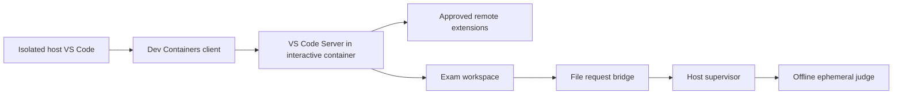

# VS Code and toolchain integration

Status: implemented. Both current images passed fresh prepare and offline attach
on the private Apple Silicon host on 2026-08-06; COMP1511 also passed Open VSC
recovery and COMP1521 passed a live MIPS/autotest/submission/report workflow.

## 1. Architecture decision

VS Code Desktop remains on the host. VS Code Server, workspace extensions,
terminals, DCC/GCC/Clang, and mipsy run in the interactive Debian container.
The separate ephemeral judge has no VS Code components.



Running a graphical VS Code desktop inside Docker would add X11/VNC/clipboard,
font, accessibility, and platform problems without improving the local threat
boundary. The supported design uses the native host UI and an isolated profile.

## 2. Isolation from normal VS Code

Each course has application-owned paths:

```text
<state>/vscode/comp1511/user-data
<state>/vscode/comp1511/extensions
<state>/vscode/comp1521/user-data
<state>/vscode/comp1521/extensions
```

Every launch passes both `--user-data-dir` and `--extensions-dir`, plus Settings
Sync off. It does not read or write the normal VS Code settings or extension
directory. The exam window has a red title/status bar and a title beginning
`CSEExamTTY ISOLATED EXAM` so it is difficult to confuse with the normal app
profile.

Seeing only a few plugins is expected and is evidence of isolation, not plugin
deletion. The allowlist is:

| Location | COMP1511 | COMP1521 |
|---|---|---|
| Isolated host | Dev Containers | Dev Containers |
| Remote container | C/C++ | C/C++, Mipsy Editor Features |

Python, Jupyter, ChatGPT, Remote SSH, Docker, account integrations, and all other
normal-profile extensions are deliberately absent.

## 3. Settings and credential boundary

The isolated host and workspace settings enforce:

- `chat.disableAIFeatures=true`;
- Settings Sync, telemetry, extension updates, Git, and Git autofetch off;
- automatic port forwarding/restoration off;
- Dev Containers Git-config copy, Docker credential helper, GitHub CLI token
  login, WSL service forwarding, Wayland mounting, and dotfiles off; and
- terminal environment removal of SSH/Git askpass variables.

The VS Code process is launched with common GitHub/Git/askpass variables removed
and `SSH_AUTH_SOCK` explicitly empty. The container has no host Git config,
Docker config/socket, SSH agent, credentials, or dotfiles.

This prevents accidental forwarding. It is not a kiosk: the host owner can
still open another ordinary application or VS Code window.

## 4. Preparation

```text
csetty prepare --profile comp1511
csetty prepare --profile comp1521
csetty doctor --offline-ready comp1511
csetty doctor --offline-ready comp1521
```

The optional `--mipsy-source PATH` is a maintainer-only provenance check for a
pinned private comparison checkout. It is not needed for preparation and is not
used by the course image.

Preparation is the networked phase. It:

1. source-builds the selected interactive and judge images and records both IDs;
2. writes isolated settings;
3. installs Dev Containers only into the isolated host extension directory;
4. opens a disposable networked preparation container;
5. lets the installed official client cache its matching VS Code Server and
   approved remote extensions in a named volume;
6. records VS Code commit, image ID, profile, and required extensions in a
   readiness manifest;
7. moves the window to a local `PREPARATION_COMPLETE.md` page; and
8. disconnects the preparation container from its bridge network and stops it.

The local completion-page transition occurs before container shutdown to avoid
leaving the user on a stale remote window showing “Cannot reconnect”.

## 5. Offline attach

At start/code time, readiness fails closed when:

- the profile was never prepared;
- the readiness JSON is invalid;
- VS Code's commit changed after preparation;
- either prepared image is missing, has a different image ID, or its source
  inputs changed;
- the isolated host Dev Containers extension is missing;
- the cached Server does not match the exact host VS Code commit; or
- the required remote-extension directories are incomplete.

CSEExamTTY starts the restricted interactive container itself, then opens an
`attached-container` folder URI. Dev Containers attaches to that existing
container and does not own its creation or relax its Docker flags. There is no
silent terminal fallback.

Per-attempt VS Code volumes are cloned from the prepared offline cache. The
interactive container remains `--network none` in exam mode and by default in
practice mode.

## 6. Container toolchain

Both Debian 12 course images contain Bash/coreutils, Python 3, GCC, Clang, Make,
GDB, Valgrind, nano/vim, man pages, and DCC 2.37 verified by SHA-256. COMP1521
also stages the installed, pinned `csetty-mips` dependency and exposes it
through a fixed `/usr/local/bin/mipsy` launcher. Its image labels record engine
name, version, and MPL-2.0 license. No Rust toolchain, upstream checkout, or
upstream mipsy binary enters the runtime image.

## 7. Runtime restrictions

Interactive and judge containers are non-root and use a read-only root
filesystem, private tmpfs mounts, CPU/memory/PID limits, `--cap-drop=ALL`, and
`no-new-privileges`. Neither receives the Docker socket. Judge containers also
always use `--network none` and a read-only submission snapshot.

The default Docker seccomp profile is retained. The private Mac validation did
not require privileged mode, seccomp unconfined, or `SYS_PTRACE` for the tested
DCC workflow.

## 8. Time broadcasts

The host supervisor writes plain fixed messages to every open student
pseudo-terminal at 60, 30, 15, and 5 minutes remaining. This reaches ordinary
Docker terminal sessions and VS Code integrated terminals. Delivery is recorded
once per threshold. On a late resume, only the nearest applicable warning is
broadcast and older thresholds are marked skipped.

If no terminal is open, a warning remains pending rather than being recorded as
delivered; the supervisor retries at a bounded interval.

## 9. Verification status

The implementation and an earlier two-course image candidate were verified on
the current Apple Silicon Mac for:

- isolated host profile and extension directory;
- matching Server plus COMP1511/COMP1521 remote extension caches;
- offline attached-container connection;
- non-root terminal with the expected tools;
- no container egress, Docker socket, Git config, SSH socket, or forwarded
  credential environment; and
- persistent workspace across a container/editor restart.

Readiness is deliberately bound to the exact image ID. On 2026-08-06 the
current COMP1511 image was rebuilt, prepared, and attached with Docker networking
disabled. The exact Server commit and the sole approved remote C/C++ extension
were observed inside the container; the companion **Open VSC** action also
reattached successfully. The normal VS Code profile remained separate.

The current COMP1521 image was rebuilt with `csetty-mips 0.1.1`, prepared without
an upstream source checkout, and accepted offline. The exact Server commit and
the C/C++ plus Mipsy Editor Features extensions were observed in the running
container. All 92 original MIPS reference cases passed inside the image, and a
live attempt produced a passing public and after-finish grade with the report
recording `csetty-mips 0.1.1` and the local-engine image labels. Preparation
opens an isolated VS Code window and is therefore an explicit user-approved
acceptance step rather than a background test.

Dev Containers normally displays a first-attach trust modal before it performs
any Docker operation. During `prepare`, CSEExamTTY records that one-time
acknowledgement inside its dedicated isolated profile. This does not modify the
normal VS Code profile, and the isolated profile is reserved for containers
created by CSEExamTTY. Preparation and later attach operations are considered
successful only after the exact matching VS Code Server process is observed
inside the target container.

Windows 11 + WSL2 Docker Desktop, macOS Intel, and Ubuntu x64/arm64 remain
public-release acceptance gates.

## 10. Sources

- [VS Code: Developing inside a Container](https://code.visualstudio.com/docs/devcontainers/containers)
- [VS Code: Dev Containers FAQ](https://code.visualstudio.com/docs/devcontainers/faq)
- [VS Code command-line options](https://code.visualstudio.com/docs/configure/command-line)
- [VS Code AI settings](https://code.visualstudio.com/docs/setup/copilot)
- [Microsoft C/C++ extension](https://marketplace.visualstudio.com/items?itemName=ms-vscode.cpptools)
- [Mipsy Editor Features extension](https://marketplace.visualstudio.com/items?itemName=xavc.xavc-mipsy-features)
- [DCC repository](https://github.com/COMP1511UNSW/dcc)
- [mipsy repository](https://github.com/insou22/mipsy)
